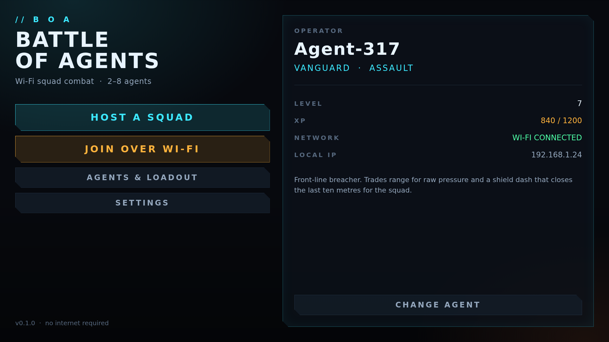

# Battle of Agents

A cinematic Wi-Fi (LAN) multiplayer action game for Android — Unity + C#.
No server, no account, no internet: one phone hosts a squad, every other phone on
the same router discovers it automatically and joins.

| | |
| --- | --- |
| Engine | Unity 2022.3 LTS · Universal Render Pipeline |
| Language | C# (no third-party runtime packages) |
| Networking | UDP broadcast discovery + TCP lobby channel, host-authoritative |
| Target | Android 7.0 (API 24) and up · ARM64 · IL2CPP |
| Output | Single debug-signed APK, wrapped in a max-compressed zip by CI |

## Screens



Every page is in [`docs/screenshots/`](docs/screenshots): splash, main menu, host a
squad, Wi-Fi browser, room lobby, agent select, in-match HUD, pause, results, settings.

## Two builds, one game

| | Unity build | Preview build |
| --- | --- | --- |
| Engine | Unity 2022.3 · URP · C# | WebGL engine in `engine/`, native Android shell |
| Workflow | `.github/workflows/android-build.yml` | `.github/workflows/preview-apk.yml` |
| Needs a Unity licence | **yes** | no |
| Status | waiting on a licence secret | **builds on every push** |

Unity retired manual Personal-licence activation — the page at
`license.unity3d.com/manual` now only accepts Pro/Plus serials — so the Unity
pipeline cannot produce a build without account credentials. Rather than leave
nothing to install, the same city, agents and weapons also run as a WebGL engine
wrapped in a small Android shell, and that path needs no licence and no secrets.

Both speak the **same LAN protocol**, so a phone running the preview APK and a
phone running the Unity build discover each other's rooms.

### Getting the Unity build going

Add either secret and `android-build.yml` starts producing the Unity APK:

| Secret | What it is |
| --- | --- |
| `UNITY_LICENSE` | Contents of a `.ulf` licence file — the Personal route |
| `UNITY_SERIAL` + `UNITY_EMAIL` + `UNITY_PASSWORD` | A Pro/Plus serial and the account that owns it |

Since Unity closed manual Personal activation, the way to get a `.ulf` is to let
Unity Hub create one and copy it off disk:

1. Install Unity Hub on your own machine and sign in (a free Personal licence is
   granted automatically).
2. Copy the whole contents of `Unity_lic.ulf`:
   - Windows — `C:\ProgramData\Unity\Unity_lic.ulf`
   - macOS — `/Library/Application Support/Unity/Unity_lic.ulf`
   - Linux — `~/.local/share/unity3d/Unity/Unity_lic.ulf`
3. Paste it into the `UNITY_LICENSE` secret.

Until then the workflow reports "build skipped" with these steps in its summary
instead of failing.

## How the Wi-Fi multiplayer works

```
HOST                                     CLIENT
 │  udp/47777  ── beacon (1 Hz) ──▶  discovery listener
 │              room, host, players, map, mode
 │
 └─ tcp/47778  ◀── hello ──          join
                ── welcome ──▶
                ── room state ──▶    (full state after every change)
                ◀── ready / team / agent / chat ──
                ── start match ──▶
```

The host owns the roster and re-broadcasts the complete room state after every
change, so clients never merge partial updates. The wire format is newline-delimited
JSON (`Assets/Scripts/Net/NetMessages.cs`) — readable in a packet capture and trivial
to version through `GameConfig.ProtocolId`.

## Repository layout

```
Assets/Scripts/Core        boot, session state, screen router
Assets/Scripts/Net         LAN discovery, lobby service, wire format
Assets/Scripts/UI          theme, widget kit, one file per screen
Assets/Scripts/Gameplay    agent roster, match state
Assets/Scripts/Visual      camera rig + post-processing stack
Assets/Editor              project configurator + CI build entry point
tools/mockups              HTML mirrors of every screen, used for review shots
.github/workflows          Android build pipeline
```

There are no `.prefab` or populated `.unity` files: the whole game builds its
objects at runtime from code (`GameBootstrap` runs on `RuntimeInitializeOnLoadMethod`).
That keeps the repo reviewable in plain diffs and the APK free of serialized assets.

## Building locally

```bash
# Unity 2022.3.62f1 with the Android module installed
Unity -batchmode -quit -projectPath . \
      -executeMethod BattleOfAgents.EditorTools.BuildScript.BuildAndroid
# → build/android/BattleOfAgents.apk
```

## Building in CI

Two workflows, described in **Two builds, one game** above:

```
preview-apk.yml    → android/  → app-release.apk   (no secrets, every push)
android-build.yml  → Unity     → BattleOfAgents.apk (needs a Unity licence)
```

Both sign with the **debug key**, so the APK installs on any phone with
"install unknown apps" enabled — the right choice for sideloading and LAN
testing. A Play Store upload would need a release key instead.

To build the preview APK locally:

```bash
cd android && gradle assembleRelease      # or ./gradlew if you generate a wrapper
# → android/app/build/outputs/apk/release/app-release.apk
```

## Keeping the download small

Applied in `Assets/Editor/BuildScript.cs`, so a clean clone reproduces them:

- ARM64 only (no fat APK) · IL2CPP · `Master` compiler configuration · size-optimised codegen
- Managed stripping **High** + `stripEngineCode` + unused mesh components stripped
- LZ4HC runtime compression, ASTC textures, no debug symbols
- `.NET Standard 2.0` profile, minimal package manifest (URP + required modules only)
- CI then wraps the APK in a `7z -mx=9 -mfb=258 -mpass=15` zip for download; the APK
  inside is byte-identical and installable — re-deflating the APK itself would
  invalidate its signing block, so we deliberately do not.

## Regenerating the screenshots

```bash
python3 tools/mockups/build_mockups.py   # HTML for every screen
tools/mockups/shoot.sh                   # → docs/screenshots/*.png (1920x1080)
```

---

## په پښتو

دا لوبه د وای‌فای پر مټ ډله‌ایزه اکشن لوبه ده. یو ګډونوال کوربه (host) کیږي، نور
هغه کسان چې په همدې راوټر پورې وصل دي، پرته له دې چې IP یا کوډ ولیکي، کوټه یې
په لیست کې ویني او ورسره یوځای کیږي.

- ژبه: C# ، انجن: Unity 2022.3 LTS ، ګرافیک: URP + سینمایي پوسټ‌پروسیسنګ
- شبکه: UDP بیکن (پیدا کول) + TCP (لابي) — کوربه واکمن دی
- خروجي: یو APK چې د GitHub Actions له لارې جوړېږي او په `7z -mx=9` کې زیپ کیږي

د پرمختګ نقشه په [`docs/PLAN.md`](docs/PLAN.md) کې ده.
