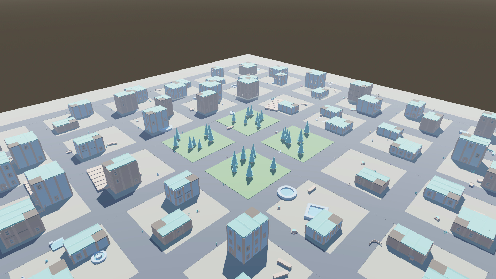

# Battle of Agents

A Wi-Fi (LAN) multiplayer action game for Android. No server, no account, no
internet: one phone hosts a squad, every other phone on the same router finds it
by itself and joins.

| | |
| --- | --- |
| Engine | Godot 4.3 · GDScript · mobile renderer |
| Networking | UDP broadcast discovery + ENet, host-authoritative damage |
| Art | CC0 kits fetched at build time, plus a supplied map when one is configured |
| Target | Android 7.0 (API 24) and up · arm64-v8a |
| Output | One debug-signed APK, wrapped in a max-compressed zip by CI |

Godot needs no licence and no account to export an APK, which is why the project
moved here: `.github/workflows/godot-apk.yml` builds an installable APK from a
clean clone with **no secrets at all**.

## Screenshots



Everything in [`docs/screenshots/`](docs/screenshots) is rendered by the game
itself in CI, not drawn by hand — see that folder's README.

## How the Wi-Fi multiplayer works

```
HOST                                      CLIENT
 │  udp/47777 ── beacon (1 Hz) ──▶  discovery listener
 │              room, host, players, map seed, mode
 │
 └─ udp+tcp/47778 (ENet)  ◀── join ──
                          ── roster ──▶   (pushed after every change)
                          ◀── moves (20 Hz, unreliable ordered) ──
                          ◀── hit requests ──
                          ── damage applied ──▶
```

Movement is client-authoritative so it stays smooth on a phone; damage is
resolved by the host, so a client cannot award itself a kill. The host sends the
map seed and nothing else — every phone builds the identical world from it, so
there is no level file to transfer.

## Where the world comes from

Nothing is modelled in code. `tools/fetch_assets.sh` downloads the art at build
time and writes a manifest; the game reads that and falls back to primitives for
anything missing, so the project still runs before a single file has been fetched.

| Category | Source | Licence |
| --- | --- | --- |
| `map` | Whatever URL `godot/assets.json` names, when it resolves | supplied |
| `walls`, `roofs` | Kenney Fantasy Town Kit | CC0 1.0 |
| `props` | Kenney Fantasy Town + Nature Kits | CC0 1.0 |
| `characters` | Quaternius Universal Animation Library, KayKit Adventurers | CC0 1.0 |
| `weapons` | KayKit Adventurers | CC0 1.0 |

If a map downloads, it is used as the world as-is: rescaled if it arrives in
something other than metres, rested on the ground, given trimesh collision and
spawn points dropped onto its floor. If it does not, a town is assembled from the
kit's wall and roof modules on a road grid — the same seed everywhere.

Which sources are used is declared in [`godot/assets.json`](godot/assets.json),
so changing the art is a one-file edit rather than a code change.

## Repository layout

```
godot/scripts/game   world building, agents, player, asset library
godot/scripts/net    LAN discovery, ENet session
godot/scripts/ui     menu, HUD, touch controls
godot/scripts/tools  the screenshot rig
godot/scenes         two scenes, one node each — the world is built at runtime
tools                the art fetcher
.github/workflows    the APK build
```

The `.tscn` files hold a single node on purpose. Everything else is assembled in
code, which keeps the repository reviewable in plain diffs.

## Building

In CI — push to a branch, or run **Godot APK** from the Actions tab. The APK is
attached to the run; `publish_release: true` also cuts a GitHub Release.

Locally:

```bash
tools/fetch_assets.sh                       # art into godot/assets/
godot --headless --path godot --import
godot --headless --path godot --export-debug "Android" build/BattleOfAgents.apk
```

It is signed with the **Android debug key**, so it installs on any phone with
"install unknown apps" enabled. A Play Store upload would need a release key.

## Keeping the download small

- arm64-v8a only, no fat APK
- the art kits are filtered to what the game actually places, not copied whole
- CI wraps the APK in a `7z -mx=9 -mfb=258 -mpass=15` zip. The APK inside is
  byte-identical: re-deflating it would invalidate its signing block, so we
  deliberately do not.

---

## په پښتو

دا لوبه د وای‌فای پر مټ ډله‌ایزه اکشن لوبه ده. یو ګډونوال کوربه (host) کیږي، نور
هغه کسان چې په همدې راوټر پورې وصل دي — پرته له دې چې IP یا کوډ ولیکي — کوټه یې
په لیست کې ویني او ورسره یوځای کیږي.

- انجن: **Godot 4.3** (لایسنس ته اړتیا نلري) ، ژبه: GDScript
- نقشه: که په `godot/assets.json` کې یوه چمتو نقشه ورکړل شوې وي هماغه کارول کیږي،
  که نه نو ښار د CC0 ماډلونو څخه پخپله جوړیږي
- کرکټرونه او اسلحې: د Quaternius او KayKit وړیا (CC0) موډلونه
- خروجي: یو APK چې د GitHub Actions له لارې پرته له هر راز (secret) جوړیږي

د پرمختګ نقشه په [`docs/PLAN.md`](docs/PLAN.md) کې ده.
